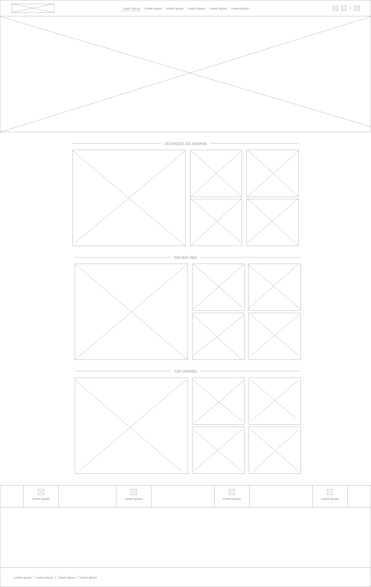
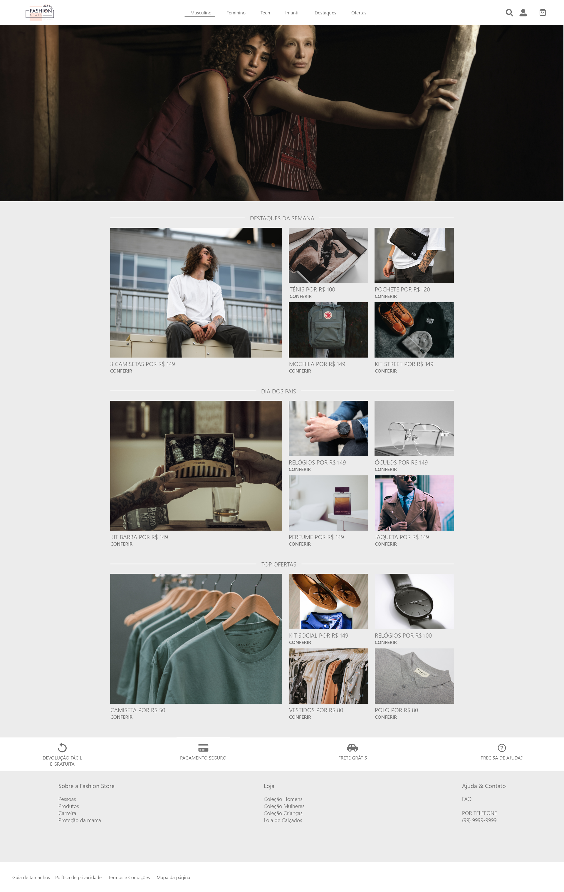

# Fashion Store - Frontend

## Resumo

Esse projeto é um desafio para uma vaga de emprego.

O projeto é a construção de front-end e back-end para um e-commerce com foco na listagem de produtos, apresentação de um produto selecionado e apresentar dele na sacola para finalização da compra.
[Link para o backend.](https://github.com/GabrielStima/fashionstore-backend)

## UI/UX
Para esse projeto peguei como exemplo 2 tipos de e-commerce com a visão de um ser mais conceitual e outro mais funcional, no caso [o e-commerce da Lacoste](https://www.lacoste.com/br/) e [o e-commerce da Kanui](https://www.kanui.com.br/), e com isso tentem criar uma mescla entre eles.

Para ver o projeto inteiro clique aqui.

### UI
Aqui está alguns frames que criei:

## Home

## Detalhar Item

### UX
Aqui está alguns frames que criei:

## Home

## Detalhar Item

## Aplicação

### Scripts

 - `npm start` : Roda o ambiente; 
   
  - `npm run build` : Roda a rotina de build padrão do create-react-app;
  
  - `npm test` : Não utilizado;
  
  - `npm eject` : Não utilizado;

### Tecnologias utilizadas

A aplicação tem as seguintes tecnologias:

 - @material-ui/core; 
 - @material-ui/lab; 
 - Axios; 
 - Dotenv; 
 - React;
 - React-icons;
 - React-router-dom; 